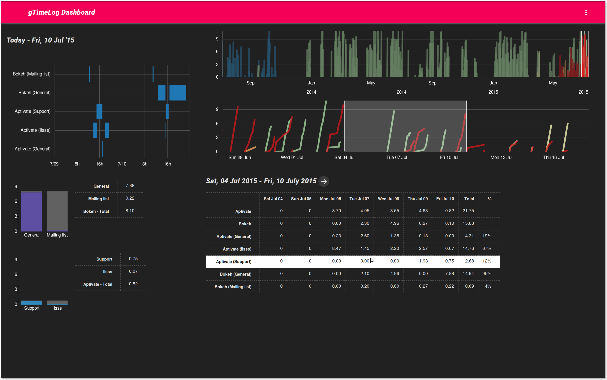
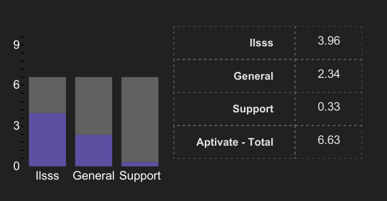
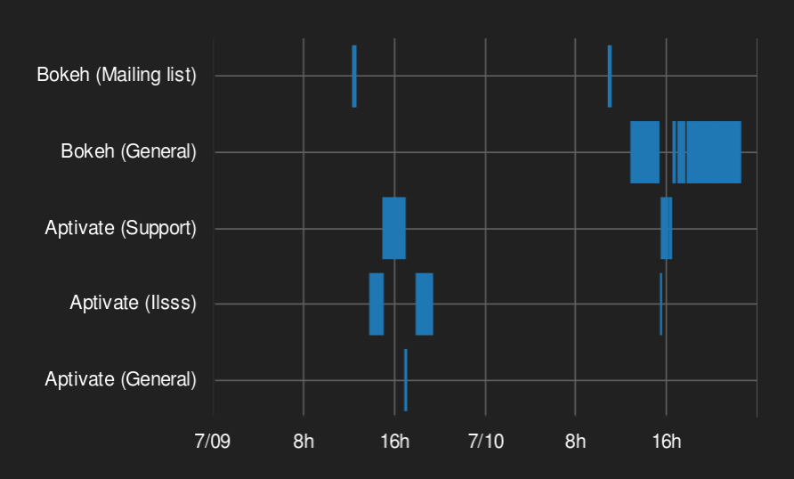
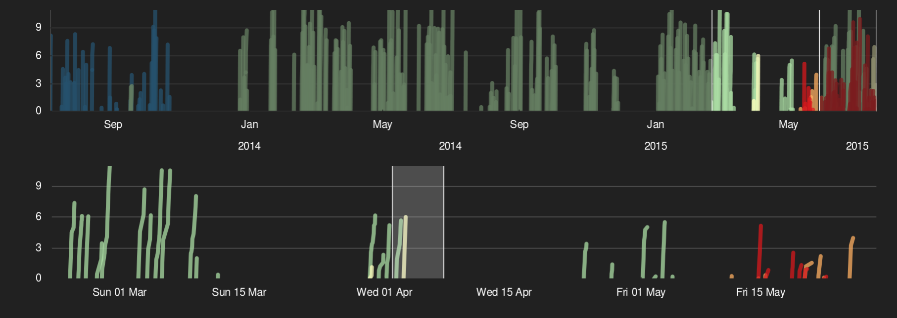

# Getting started with Bokeh 
Let's build an interactive data visualization for the web...in Python! 

#### Sarah Bird - Europython 2015
---
<a href="http://localhost:5000">Live demo....</a>


---

### app

github.com/birdsarah/gtimelog-viz

### slides

birdsarah.github.io/europython-2015-bokeh

### me

@birdsarah

---

# Bokeh


* data visualization library
 * d3.js & many more
 * matplotlib / seaborn
* web
* interactive
* dynamic & data-driven
* roots in data science

---

# Why bokeh?

from data science:

* interactive
* web - publishing & portability

from web dev:

* python vs javascript
* mid-sized data 1-10k | 10-100k

both:

* intuitive
* server-side processing & updating
* fully open-source

---


---


---


---


---


---


`conda install bokeh`

`pip install bokeh`

****
optional

`conda install ipython-notebook pandas`

`pip install "ipython[notebook]" pandas`


---

## bokeh.models (high customization)


* The lowest level
* Offers you the most control
* Do all the work yourself

<p></p>

## bokeh.plotting

* Tries to pick sensible defaults
* You organize your data, it organizes your plot
<p></p>

## bokeh.charts (high speed)

* One-line charts
* Processes your data & spits out a chart

---

* data
* io
* charts 
* plotting 
* models 
* layout & embedding
* styling
* interactive

.... and there's more in a couple of hours - Fabio Pliger's talk.
---

# Data.....

At the heart of Bokeh is the `ColumnDataSource`

| 'column of xs' | 'column of ys'
|---|---
|0|1 
|1|2
|3|4

[notebooks/ColumnDataSource.ipynb](http://localhost:8888/notebooks/notebooks/ColumnDataSource.ipynb)

---

and the `Plot`

```python
from bokeh.models import Plot
p = Plot
```
```python
from bokeh.plotting import figure
p = figure()
```
```python
from bokeh.plotting import Chart
p = Chart()
```
They're basically the same thing with the same key methods/attributes on them.

[notebooks/Plot.ipynb](http://localhost:8888/notebooks/notebooks/Plot.ipynb)

---
# chart



[notebooks/Chart.ipynb](http://localhost:8888/notebooks/notebooks/Chart.ipynb)

---
# io

output_notebook
```python
from bokeh.io import output_notebook, show
output_notebook()

bar = Bar(bar_df, stacked=True, palette=['purple', 'gray'])

show(bar)
```

output_file
```python
from bokeh.io import output_file, show
output_file('my_bar_chart.html', mode='cdn')  # CDN mode keeps your output small

bar = Bar(bar_df, stacked=True, palette=['purple', 'gray'])

show(bar)  # Also see save(bar)
```

---

# Plotting



[notebooks/Plotting.ipynb](http://localhost:8888/notebooks/notebooks/Plotting.ipynb)

---

# Plotting
````python
source = ColumnDataSource(data)
p = figure(
    x_range=Range1d(start, end),  # start & end time for x_range 
    y_range=FactorRange(factors=activities), # list of categoeis for y_range
    plot_height=300, plot_width=800
)
p.quad(left='start', right='end', top='activity_top', bottom='activity_bottom', source=source)
````
---

# Models


[notebooks/Models.ipynb](http://localhost:8888/notebooks/notebooks/Models.ipynb)

---

# Models

* [bokeh.pydata.org/docs/reference/models.html](http://bokeh.pydata.org/en/latest/docs/reference/models.html)
* [github.com/bokeh/bokeh/tree/master/examples/glyphs](https://github.com/bokeh/bokeh/tree/master/examples/glyphs) - download and run them!


---

# Styling

One of the areas where models vs plotting/charts becomes obvious.
Models can become more succinct, and eaier to read (I think).

Anything is possible on all versions - pick your favorite.

---

# Styling a chart

```python
    plot = Bar(
        data, stacked=True,
        width=200, height=200, 
        palette=[color, COLOR_PRIMARY_DARK], tools=''
    )

    # Get chart items
    glyphs = plot.select({'type': GlyphRenderer})
    xaxis = plot.select({'type': CategoricalAxis})
    yaxis = plot.select({'type': LinearAxis})
    ygrid = plot.select({'type': Grid})

    # Format chart properties
    plot.toolbar_location = None
    plot.background_fill = COLOR_PRIMARY
    plot.border_fill = COLOR_PRIMARY
    plot.outline_line_color = None
    plot.min_border = 5
    plot.min_border_top = 0

    # Format lines
    for g in glyphs:
        g.glyph.fill_alpha = 1
        g.glyph.line_color = None

    # Set xaxis properties
    xaxis.major_label_text_color = COLOR_PRIMARY_CONTRAST
    xaxis.major_label_orientation = 0
    xaxis.major_label_standoff = 15
    xaxis.major_tick_out = None
    xaxis.major_tick_in = None
    xaxis.axis_line_color = None

    # Set yaxis properties
    yaxis.major_label_text_color = COLOR_PRIMARY_CONTRAST
    yaxis.major_tick_out = None
    yaxis.major_tick_in = None
    yaxis.axis_line_color = None

    # Grid lines
    ygrid.grid_line_color = None
```
---

# Styling with models

```python
p = Plot(
    x_range=FactorRange(factors=source.data.get('cat')),
    y_range=Range1d(0, 9),
    toolbar_location=None,
    background_fill=COLOR_PRIMARY,
    border_fill=COLOR_PRIMARY,
    outline_line_color=None,
    min_border=5,
)

AXIS_PROPERTIES = dict(
    major_label_text_color=COLOR_PRIMARY_CONTRAST,
    axis_line_color=None,
    major_tick_line_color=None,
    minor_tick_line_color=None,
)
y_axis = LinearAxis(**AXIS_PROPERTIES)
x_axis = CategoricalAxis(**AXIS_PROPERTIES)

RECT_PROPERTIES = dict(x="cat", width="width", line_color=None)
base = Rect(y='yhuman', height='human', fill_color=COLOR_ACCENT, **RECT_PROPERTIES)
total = Rect(y='ytotal', height='total', fill_color=COLOR_PRIMARY_DARK, **RECT_PROPERTIES)

p.add_layout(y_axis, 'left')
p.add_layout(x_axis, 'below')
p.add_glyph(source, base)
p.add_glyph(source, total)
```

---

A "stylesheet"

````python
PALETTE_GREY_900 = '#212121'
PALETTE_GREY_700 = '#616161'
PALETTE_PINK_A400 = '#f50057'

COLOR_DARK_CONTRAST = 'white'

COLOR_PRIMARY = PALETTE_GREY_900
COLOR_PRIMARY_DARK = PALETTE_GREY_700
COLOR_ACCENT = PALETTE_PINK_A400

COLOR_PRIMARY_CONTRAST = COLOR_DARK_CONTRAST
COLOR_ACCENT_CONTRAST = COLOR_DARK_CONTRAST

AXIS_PROPERTIES = dict(
    major_label_text_color=COLOR_PRIMARY_CONTRAST,
    axis_line_color=COLOR_PRIMARY,
    major_tick_line_color=COLOR_PRIMARY,
    minor_tick_line_color=COLOR_PRIMARY,
)
````


---
Read the docs:
[bokeh.pydata.org/docs/user_guide/styling.html](http://bokeh.pydata.org/en/latest/docs/user_guide/styling.html)

Experiment: 
[notebooks/Prototyping.ipynb](http://localhost:8888/notebooks/notebooks/Prototyping.ipynb)

---

# Layout & Embedding
````python
from bokeh.io import vplot, hplot

from bokeh.embed import components
````
[notebooks/Layout-Embed.ipynb](http://localhost:8888/notebooks/notebooks/Layout-Embed.ipynb)

---

Add some tables `pandas.DataFrame.to_html()` and a more complete template

[live demo. ...](http://localhost:5000/2015-07-10/)

---

# Interactive

* Tools - Hover, Select, Zoom, Pan
* Shared selection & panning

[notebooks/Tools_Selection_Panning.ipynb](http://localhost:8888/notebooks/notebooks/Tools_Selection_Panning.ipynb)

---

# Callbacks

Write a small piece of javascript to happen on interaction.

* Widgets - Button, Toggle, Dropdown, TextInput, AutocompleteInput, Select, Multiselect, Slider, (DateRangeSlider), DatePicker, 
* Tools - TapTool*, BoxSelectTool, HoverTool, 
* Selection - ColumnDataSource, AjaxDataSource, BlazeDataSource, ServerDataSource
* Ranges - Range1d, DataRange1d, FactorRange

---


---

<iframe width=900 height=500 src="http://localhost:8002/gapminder_simple.html"></iframe>

Slider - change source of Text and Bubbles

---


* Pre-built "actions" - e.g. OpenURL

---

[change color](http://localhost:5000/2015-07-10/)

```python

from bokeh.models import Plot, Range1d, Callback, ...

plot = Plot(
    x_range=Range1d(start=two_weeks_ago, end=one_week_forward),
    # configure all the other pieces....
)

plot.x_range.callback = Callback(
    code="""
        $("#timesheet_submit").addClass("mdl-button--colored");
    """
)

```
---

Use your python objects

````python
source = ColumnDataSource(data)

code = 

callback = Callback(
    args={'my_column_data_source': source}, 
    code="my_column_data_source.set('selected', cb_data['index']);"
)

plot.add_tools(HoverTool(tooltips=None, callback=callback))
````

---

# Use ALL YOUR PYTHON OBJECTS

```python
script, divs = components({
        'all_time_line': all_time_line,
        'detail_time_line': detail_time_line,
        'time_log': time_log,
        'beekeeping': today_plots['Beekeeping_bar'],
        'python': today_plots['Python_bar'],
    })
```

[live demo](http://localhost:5000/2015-07-10/)

---

* data
* io
* charts 
* plotting 
* models 
* layout & embedding
* styling
* interactive

.... and there's more in a couple of hours - Fabio Pliger's talk.

* widgets
* server
* other data sources

---

# Questions

[github.com/bokeh/bokeh/](https://github.com/bokeh/bokeh/)

[groups.google.com/a/continuum.io/forum/#!forum/bokeh](https://groups.google.com/a/continuum.io/forum/#!forum/bokeh)

---

Which one should I pick?

* Making your website - models
* Poking data - charts
* More complex poking or presenting to colleagues - plotting

They're all the same thing though

---

# Further reading

* Exporting & Embedding - [bokeh.pydata.org/docs/reference/resources_embedding.html](http://bokeh.pydata.org/docs/reference/resources_embedding.html)
* User guide - [bokeh.pydata.org/docs/user_guide.html](http://bokeh.pydata.org/docs/user_guide.html)
* Tutorial notebooks - [github.com/bokeh/bokeh-notebooks/tutorial](http://github.com/bokeh/bokeh-notebooks/tutorial)
